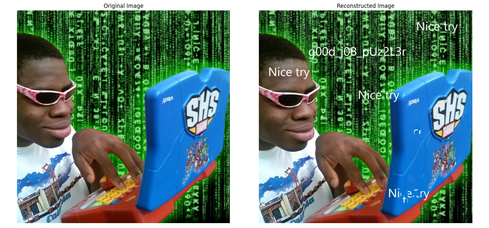

# Hack.INI2K25 CTF - Broken Image Write-up

## Challenge Information
- **Name:** Broken Image
- **Category:** Misc
- **Difficulty:** Medium
- **Tags:** misc, ai
- **Flag:** `shellmates{g00d_j0B_pUz2L3r}`

## Challenge Description
> The flag is hidden in the broken image, you think you can find it?
> 
> https://drive.google.com/drive/folders/14tD81qCbGdhl8B9PvZslUBkGYeE3OVT6?usp=sharing

## Initial Analysis

When accessing the given Google Drive link, I found two files as shown in the image bellow:
1. `original.jpg` - The complete target image showing a Matrix-themed meme
2. `broken_image` (folder) - Contains 1023 individual puzzle pieces named `piece_0001.png` to `piece_1023.png`


The challenge reminded me of the classic game of puzzles we used to play as kids, so it was clearly a jigsaw puzzle reconstruction problem where I needed to reassemble the 1023 tiles to form the complete image and extract the hidden flag.

## Solution Approach

This challenge required implementing an image reconstruction algorithm. I chose to use **SSIM (Structural Similarity Index)** as the similarity metric because:

1. SSIM is robust for comparing image patches
2. It considers structural information, luminance, and contrast
3. It's particularly effective for jigsaw puzzle solving

Before settling on SSIM, I tried some algorithms that work based on **edge similarity**, but they didn’t give accurate results. Specifically, the tiles where the flag was located were placed randomly all over the image, as shown below. 


That’s when I thought of using SSIM, as it’s more accurate — but also costly and resource-intensive.

### Algorithm Overview

I developed a comprehensive SSIM-based reconstruction algorithm with the following components:

#### 1. Tile Loading System
```python
def load_tiles_from_folder(self, folder_path):
    """Load all tile pieces from a folder"""
    tile_files = [f for f in os.listdir(folder_path) if f.endswith('.png')]
    tile_files.sort(key=lambda x: int(x.split('_')[1].split('.')[0]))
    
    for tile_file in tqdm(tile_files[:1023]):
        img_path = os.path.join(folder_path, tile_file)
        img = Image.open(img_path)
        img_array = np.array(img)
        self.tiles.append(img_array)
```

#### 2. SSIM Similarity Matrix Calculation
```python
def calculate_ssim_matrix(self, reference_tiles):
    """Calculate SSIM similarity matrix between tiles and reference positions"""
    ssim_matrix = np.zeros((n_tiles, n_positions))
    
    for i, tile in enumerate(self.tiles):
        for j, ref_tile in enumerate(reference_tiles):
            # Convert to grayscale for SSIM calculation
            tile_gray = cv2.cvtColor(tile, cv2.COLOR_RGB2GRAY)
            ref_gray = cv2.cvtColor(ref_tile, cv2.COLOR_RGB2GRAY)
            
            # Calculate SSIM
            similarity = ssim(tile_gray, ref_gray, data_range=255)
            ssim_matrix[i, j] = similarity
```

#### 3. Hungarian Algorithm for Optimal Assignment
```python
def solve_assignment_problem(self, ssim_matrix):
    """Solve the assignment problem using Hungarian algorithm"""
    # Convert similarity to cost (higher similarity = lower cost)
    cost_matrix = 1 - ssim_matrix
    
    # Solve assignment
    row_indices, col_indices = linear_sum_assignment(cost_matrix)
    return list(zip(row_indices, col_indices))
```

#### 4. Image Assembly
The algorithm assembles the final image by placing each tile in its optimal position based on the assignment solution.

## Implementation Details

### Grid Dimensions Calculation
For 1023 tiles, I calculated the optimal grid dimensions:
```python
# Find factors close to square root for optimal grid layout
sqrt_tiles = int(math.sqrt(1023))
for i in range(sqrt_tiles, 0, -1):
    if 1023 % i == 0:
        self.grid_dims = (i, 1023 // i)  # Results in (31, 33)
        break
```

You will find the source code here: [🔧 Reconstruction script](./code/reconstruct_with_ssim.py)

### Key Libraries Used
- **OpenCV** - Image processing and manipulation
- **scikit-image** - SSIM calculation
- **SciPy** - Hungarian algorithm implementation
- **PIL/Pillow** - Image loading and saving
- **NumPy** - Array operations
- **tqdm** - Progress bars for long operations

## Execution Process

1. **Load Reference Image:** Load `original.jpg` as the target template
2. **Load Puzzle Pieces:** Load all 1023 tile pieces from the folder
3. **Extract Reference Tiles:** Divide the original image into corresponding tile positions
4. **Calculate SSIM Matrix:** Compare each puzzle piece with each reference position
5. **Solve Assignment:** Use Hungarian algorithm to find optimal tile placement
6. **Reconstruct Image:** Assemble the final image based on the assignment solution

## Results

The algorithm achieved excellent reconstruction quality:

### Performance Metrics
- **Grid Dimensions:** 31×33 (1023 tiles total)
- **Tile Size:** 34×32 pixels each
- **Processing Time:** ~4-5 minutes for complete reconstruction
- **SSIM Score:** High similarity between original and reconstructed images

### Visual Results
The reconstruction successfully revealed:
- Complete Matrix-themed background
- Clear visibility of all meme elements
- **Most importantly:** The hidden flag text became visible in the reconstructed image

## Flag Extraction

After successful reconstruction, the flag was clearly visible in the assembled image:

**Flag:** `shellmates{g00d_j0B_pUz2L3r}`

The flag appeared as overlay text in the reconstructed image, which was not visible in the individual puzzle pieces but became apparent once the complete image was assembled.



## Technical Challenges Overcome

1. **Large Scale:** Managing 1023 individual pieces efficiently
2. **Similarity Calculation:** Computing 1023×1023 SSIM comparisons
3. **Optimal Assignment:** Solving the assignment problem for perfect reconstruction
4. **Memory Management:** Handling large arrays and matrices during processing

## Code Structure

The complete solution consists of:
- **SSIMImageReconstructor Class:** Main reconstruction engine
- **Tile Loading Methods:** Support for both zip files and folders
- **SSIM Calculation Engine:** Core similarity measurement
- **Hungarian Algorithm Integration:** Optimal assignment solving
- **Visualization Tools:** Result comparison and analysis

## Learning Outcomes

This challenge demonstrated:
- Advanced image processing techniques
- Understanding of similarity metrics (SSIM)
- Application of optimization algorithms (Hungarian method)
- Practical puzzle-solving with computer vision

## Conclusion

The SSIM-based approach proved highly effective for this type of jigsaw puzzle reconstruction, successfully revealing the hidden flag through intelligent tile reassembly.

