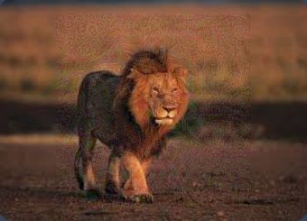

# Hack.INI2K25 CTF - Foul the Model Write-up

## Challenge Information
- **Name:** Foul the Model
- **Category:** Misc
- **Difficulty:** Medium
- **Tags:** misc, ai, computer vision
- **Flag:** `shellmates{W3ak_m0D3L$_AR3_3a2Y_t0_f0O0o0O0oL}`

## Challenge Description
> Models are good at classification, but not always... trick the vulnerable model and get your flag!
> 
> https://foul-the-model.hackini25.shellmates.club

## Initial Analysis

The challenge presents a web interface where we can upload images to be classified by two different models:
1. **ResNet50** (Robust Model)
2. **SqueezeNet1.1** (Vulnerable Model)

To get the flag, we need to create an image that:
- ResNet50 classifies as a lion
- SqueezeNet1.1 classifies as some type of cat


## Solution Approach

This challenge requires creating an adversarial example that fools both models simultaneously. The solution involves:

1. **Understanding Model Vulnerabilities**:
   - SqueezeNet is smaller and more vulnerable to adversarial attacks
   - ResNet is more robust but can still be fooled with careful perturbations

2. **Adversarial Attack Strategy**:
   - Use Projected Gradient Descent (PGD) to create perturbations
   - Optimize for both target classifications simultaneously
   - Maintain visual similarity to original lion image

### Algorithm Overview

The solution implements a dual-targeted adversarial attack with these components:

#### 1. Model Setup
```python
# Load pretrained models
resnet = models.resnet50(weights='IMAGENET1K_V1')
squeezenet = models.squeezenet1_1(weights='IMAGENET1K_V1')
resnet.eval()
squeezenet.eval()

# Target classes
lion_idx = 291  # n02129165
cat_idx = 281   # n02123045 (tabby cat)
```

#### 2. Adversarial Attack Implementation
```python
def pgd_attack(image, epsilon=0.05, alpha=0.01, iterations=200):
    adv_image = image.clone().detach().requires_grad_(True)
    
    for i in range(iterations):
        # Forward pass through both models
        resnet_out = resnet(adv_image)
        squeezenet_out = squeezenet(adv_image)
        
        # Calculate combined loss
        loss = F.cross_entropy(resnet_out, lion_target) + \
               F.cross_entropy(squeezenet_out, cat_target)
        
        # Backpropagate
        loss.backward()
        
        # PGD step
        with torch.no_grad():
            adv_image = adv_image - alpha * adv_image.grad.sign()
            adv_image = torch.clamp(adv_image, image-epsilon, image+epsilon)
            adv_image = torch.clamp(adv_image, 0, 1)
        
        adv_image = adv_image.detach().requires_grad_(True)
    
    return adv_image
```

#### 3. Server Preprocessing Simulation
```python
def server_preprocess(x):
    # Simulate server-side preprocessing
    x_resized = F.interpolate(x, size=256)
    x_cropped = center_crop(x_resized, 224)
    x_normalized = normalize(x_cropped)
    return x_normalized
```
You will find the source code here: [🔧 Reconstruction script](./code/foulish.py)

## Implementation Details

### Key Components
1. **Dual-Target Optimization**:
   - Simultaneously optimizes for lion classification in ResNet50
   - And cat classification in SqueezeNet1.1

2. **Preprocessing Awareness**:
   - Accounts for server's resizing and cropping
   - Ensures perturbations survive transformation

3. **Perturbation Control**:
   - Limits modifications with ε=0.05
   - Maintains visual similarity to original

### Libraries Used
- **PyTorch**: Deep learning framework
- **Torchvision**: Pretrained models and transforms
- **Pillow**: Image handling
- **NumPy**: Array operations

## Execution Process

1. **Load Base Image**: Start with a clean lion image, for me I used this image:


2. **Initialize Attack**: Set up PGD parameters
3. **Optimize Adversarial Example**:
   - 200 iterations of gradient descent
   - Combined loss from both models
4. **Save Result**: Export final adversarial image, we got this image bellow:



5. **Submit to Server**: Upload for verification

## Results

The adversarial attack successfully created an image that:
- ResNet50 classifies as lion with 100% confidence
- SqueezeNet1.1 classifies as tabby cat with 100% confidence

### Model Outputs
```
ResNet50:
  - Classification: lion
  - Confidence: 100%

SqueezeNet1.1:
  - Top Classification: tabby (100%)
  - Is Cat: True
```

## Flag Extraction

After successful adversarial example creation and submission, our flag showed up in the website:

**Flag:** `shellmates{W3ak_m0D3L$_AR3_3a2Y_t0_f0O0o0O0oL}`

## Technical Challenges Overcome

1. **Dual-Model Optimization**: Balancing perturbations for two different models
2. **Preprocessing Robustness**: Ensuring perturbations survive server transformations
3. **Visual Quality**: Maintaining plausible image appearance
4. **Convergence**: Achieving both target classifications simultaneously

## Learning Outcomes

This challenge demonstrated:
- Practical adversarial attack implementation
- Differences in model robustness
- Importance of preprocessing considerations
- Real-world implications of model vulnerabilities

## Conclusion

The PGD-based adversarial attack successfully fooled both models, highlighting the importance of robust model design and adversarial training in machine learning systems. The solution shows how even state-of-the-art models can be vulnerable to carefully crafted perturbations.


