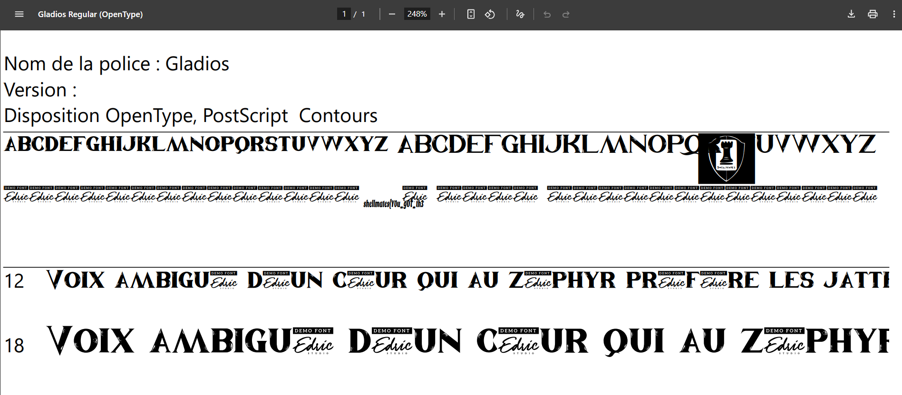

# Hack.INI2K25 CTF - Gladios Write-up

## Challenge Information
- **Name:** Gladios
- **Category:** Web
- **Difficulty:** Easy
- **Tags:** web
- **Flag:** `shellmates{Y0u_g0T_th3_gL4D10_rigHTTtT}`

## Challenge Description
> Write Your Gladiator Thoughts...

## Initial Analysis

The challenge presents a web interface where we can write anything we want in the textarea

## Solution Approach

At first, the website didn’t seem suspicious. When inspecting, there was nothing out of the ordinary, except for a custom font file named **gladios.otf**. With my background in design (yes, we designers remember fonts like psychos), I noticed this one wasn’t familiar. So I downloaded and opened it.

Once opened, I found that the font was personalized by **Shellmates**. What stood out was a string embedded in the font that looked like the first part of the flag: `shellmates{Y0u_g0T_th3`. 

To find the second part, I used the websites https://wakamaifondue.com & https://www.glyphrstudio.com/app to explore the font further. I discovered that the first part of the flag was stored in the apostrophe `'` character. The second part was embedded in a ligature called `Hello`, which yielded the string: `_gL4D10_rigHTTtT}`

## Assembling the Flag

The complete and final flag is: 
`shellmates{Y0u_g0T_th3_gL4D10_rigHTTtT}`
