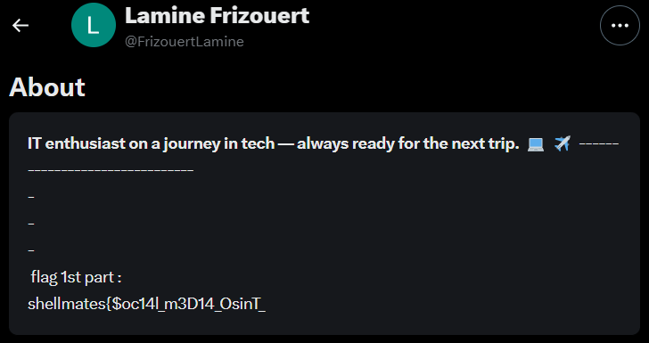

# Hack.INI2K25 CTF - Iceberg 1 Write-up

## Challenge Information
- **Name:** Iceberg 1
- **Category:** OSINT
- **Difficulty:** Easy
- **Tags:** misc, osint
- **Flag:** `shellmates{$oc14l_m3D14_OsinT_IsNt_HaRd}`

## Challenge Description
> A mysterious figure known only by the last name "Frizouert". Your mission is to track down his presence on various social media platforms. Somewhere in his digital footprint lies the flag.

## My Investigation Process

I started by doing a simple Google search for "Frizouert" which returned several social media profiles. One that stood out was a Twitter (currently known as X) account under the handle **@FrizouertLamine**. The profile appeared to belong to someone named Lamine, and looking at the account's activity, it seemed recent and legitimate.

When I checked the profile's bio section, there it was - the first part of our flag: `shellmates{$oc14l_m3D14_OsinT_`. This confirmed I was on the right track with this Lamine Frizouert individual.

Knowing flags in these challenges are often split across platforms, I then searched for this person on Instagram. Using variations of "lamine frizouert" led me to an Instagram account **@frizouertlamine**. After carefully checking the profile - the bio, posts, and story highlights, I found the second piece of the flag in the caption of their first post: `IsNt_HaRd}`.

## Assembling the Flag
Putting the two parts together from Twitter and Instagram gave us the complete flag:
`shellmates{$oc14l_m3D14_OsinT_IsNt_HaRd}`

