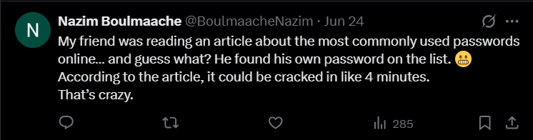

# Hack.INI2K25 CTF - Iceberg 2 Write-up

## Challenge Information
- **Name:** Iceberg 2
- **Category:** OSINT
- **Difficulty:** Medium
- **Tags:** misc, osint
- **Flag:** `shellmates{FrizouFb#2000_InstaLam20!}`

## Challenge Description
> Lamine Frizouert and his friend both unknowingly caused a major security leak. Some of Frizouert’s accounts were compromised, but he later recovered them. Can you find out what his Instagram and Facebook passwords were at the time? flag format : shellmates{facebookpassword_instapassword} Example : shellmates{Frizouert2000_Frizouert@2000}

## My Investigation Process

I started by returning to Lamine's Twitter profile **@FrizouertLamine**, this time conducting a much deeper inspection of his tweets and replies. After carefully scrolling through his interactions, I noticed something interesting, only one person seemed to be actively engaging with his posts: someone named `Nazim Boulmaache` **(@BoulmaacheNazim)**. This immediately caught my attention since the challenge brief mentioned Lamine's **"friend"** being involved in the security incident.

Upon investigating Nazim's Twitter profile, I found a particularly revealing tweet:

> "My friend was reading an article about the most commonly used passwords online... and guess what? He found his own password on the list. 😬 
> According to the article, it could be cracked in like 4 minutes. That's crazy."

This seemed like a crucial hint, though its exact meaning wasn't immediately clear. I made a mental note of this **"4 minutes"** reference, suspecting it would become important later in the challenge.

Knowing that social media clues often span multiple platforms, I decided to look for Nazim on **Instagram**. 
Interestingly, he didn't appear in Lamine's follower list, but a simple search for **"boulmaachenazim"** brought up his profile. Scrolling through his posts, I found a revealing exchange in the comments section of one of his pictures:

The Instagram comments showed a public conversation where Lamine and Nazim were exchanging links to Proton Drive files, that's a **major security red flag**. The exchange went like this:

1. Lamine shared a drive link
2. Nazim replied saying he couldn't access it
3. Lamine then shared a corrected link

This perfectly matched the challenge description about them **"unknowingly causing a major security leak."** The public sharing of private drive links was clearly the security vulnerability mentioned in the challenge.

The first drive link required **a password**. After I tried to bypass the password with some well know and high possible passwords, I remembered Nazim's tweet about passwords that take **4 minutes to crack** in a **certain article**, I researched common password lists with crack times. The NordPass most common passwords list (https://nordpass.com/most-common-passwords-list/) showed that **"7758521"** was the only password with exactly a 4-minute crack time.

Using this password, I successfully accessed the protected drive. Inside, I hit the jackpot!! An Excel spreadsheet containing a list of Lamine's social media and emails accounts and their corresponding passwords!

## Assembling the Flag

From the spreadsheet, I extracted:

- Lamine's Facebook password: FrizouFb#2000
- Lamine's Instagram password: InstaLam20!

Combining these in the specified format gave me the complete flag: 
`shellmates{FrizouFb#2000_InstaLam20!}`

