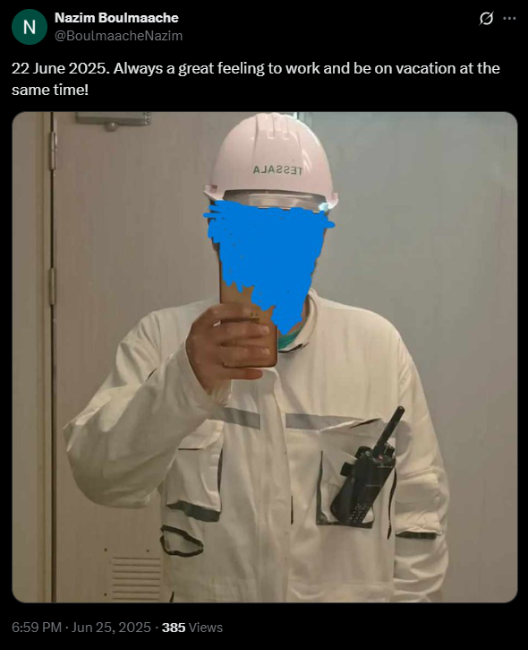

# Hack.INI2K25 CTF - Iceberg 3 Write-up

## Challenge Information
- **Name:** Iceberg 3
- **Category:** OSINT
- **Difficulty:** Medium
- **Tags:** misc, osint
- **Flag:** `shellmates{spain_hyproc-shipping-company_cherouati_menasria_99B0103669}`

## Challenge Description
> Frizouert and his friend went on a short vacation on June 22, 2025. His friend somehow managed to work and relax at the same time. Can you trace their trip and uncover the full travel details?
> destination: where they traveled (country) 
> owner: the company that owns the method of transport they used 
> CEO: the last name of the company's CEO 
> contact: the last name of the company’s technical contact
> Registration Number: the companies registration number flag:
> shellmates{destination_owner_CEO_contact_registrationnum}

## My Investigation Process

I began my investigation on instagram checking both Lamine and Nazim's Instagram profiles. Lamine's account was particularly unhelpful, filled with what appeared to be generic stock images complete with watermarks, hardly the authentic vacation photos I was hoping to find. However, Nazim's profile held more promise. His **June 24, 2025** post caught my attention immediately. The photo looked genuinely personal, showing what appeared to be a **ship's deck** with ocean visible in the background. More importantly, he had tagged Lamine in the caption with the message **"Peaceful nights,"** confirming they were indeed traveling together around the specified date.

Turning to Twitter we found more valuable clues. Nazim's June 25 tweet showed him wearing a work uniform with the caption: 

> "22 June 2025. Always a great feeling to work and be on vacation at the same time!" 

This perfectly aligned with the challenge description. With a closer inspection of the photo, I noticed mirrored writing on his white helmet. Using basic image editing tools to reverse the text revealed the word **"TESSALA."** A quick search identified this as the name of a vessel owned by **the Algerian company Hyproc Shipping**. This explained how Nazim could work while vacationing, he was traveling aboard the ship he worked on!

With the vessel identified, I researched the TESSALA's movement history. Shipping records showed it had docked in **Sagunto, Spain** on **June 22, 2025**, EXACTLY the same date mentioned in the challenge. This gave us our destination country **"Spain".**

Investigating Hyproc Shipping Company revealed several key details. The current CEO was identified as **Adil Cherouati** through corporate filings. 

The company's registration number, **'99B0103669'**, was found in official business registries. 

However, the technical contact proved more elusive. After exhausting standard sources like LinkedIn and corporate directories, I finally discovered the information on an **obscure** Algerian business registry website (https://www.idn.dz/search?name=hyproc), which finally listed the technical contact as **Menasria Abdelhak**.

## Assembling the Flag

Assembling all components:

**- Destination:** Spain
**- Transport owner:** hyproc shipping company
**- CEO:** CHEROUATI
**- Technical contact:** MENASRIA
**- Registration number:** 99B0103669

The complete and final flag is: 
`shellmates{spain_hyproc-shipping-company_CHEROUATI_MENASRIA_99B0103669}`

